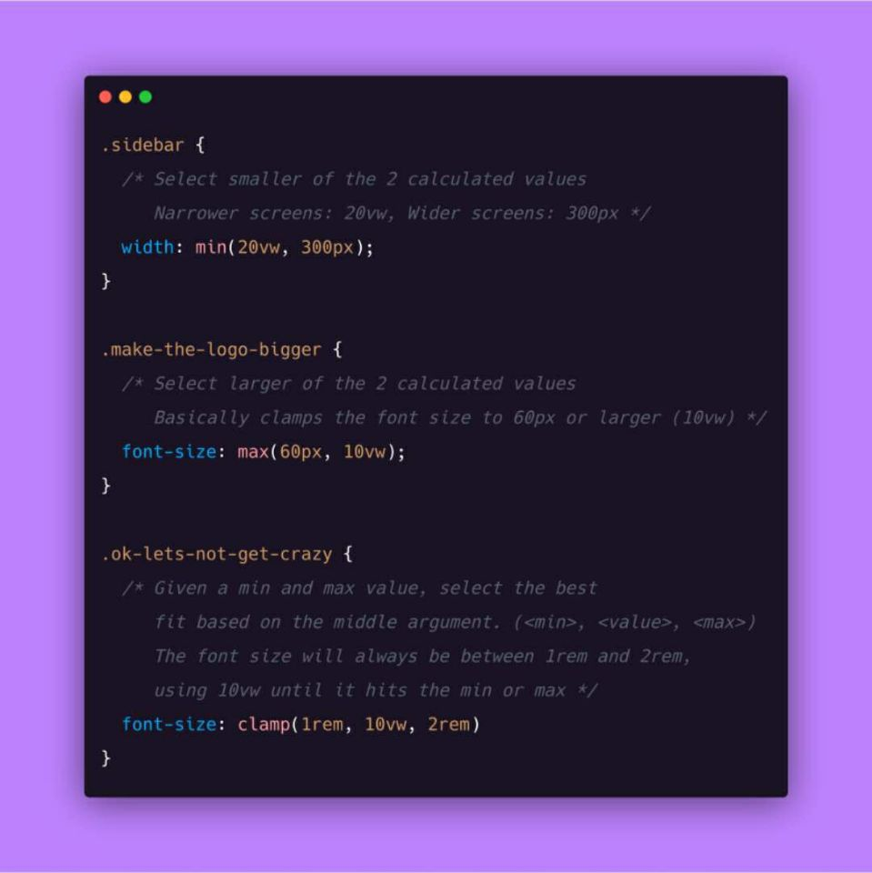
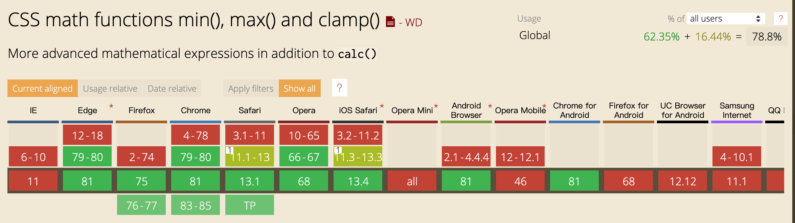

# css函数



## min()

计算表达式的值中最小的值作为参数值

类似 `JS` 中的 `Math.min()`

示例
```` css
width: min(50vw, 500px);
````
表示元素最大宽为 `500px`，即：小屏设备上宽度为 `window` 的一半，但在小屏设备上，不超过 `500px`

## max()
计算表达式的值中最大的值作为参数值，用法和 `min` 一致

## clamp()
返回一个区间范围的值

语法: `clamp(MIN, VAL, MAX)，MIN` 表示最小值，`VAL` 表示首选值，`MAX`表示最大值，即 `VAL` 在 `MIN MAX` 之间就用` VAL`，比` MIN` 小就用 `MIN` ，比` MAX` 大就用 `MAX`

等同于 `max(MIN, min(VAL, MAX))`

## 组合使用
`min() max() clamp()` 这三哥们都是比较新的属性，兼容性都不咋地，仅用于个人玩



```html
<!DOCTYPE html>
<html lang="en">
  <head>
    <meta charset="UTF-8" />
    <meta name="viewport" content="width=device-width, initial-scale=1.0" />
    <meta http-equiv="X-UA-Compatible" content="ie=edge" />
    <title>Static Template</title>
    <style>
      .min {
        /* width: min(20px, 30px, 40px); */
        width: min(2rem, 15vw);
        height: 100px;
        font-size: min(16px, 10vw);
        line-height: min(16px, 10vw);
        background: forestgreen;
      }
      .max {
        width: max(2rem, 15vw);
        height: 100px;
        font-size: max(16px, 10vw);
        line-height: max(16px, 10vw);
        background: red;
      }
      .clamp {
        width: clamp(2rem, 40px, 15vw);
        height: 100px;
        background: blue;
      }
      .min-calc {
        width: max(calc(100vw - 20px - 3rem - 20vh), 40px);
        height: 100px;
        background: orange;
      }
    </style>
  </head>
  <body>
    <div class="min">min</div>
    <div class="max">max</div>
    <div class="clamp">clamp</div>
    <div class="min-calc">min calc</div>
  </body>
</html>
```

[demo](https://codesandbox.io/p/sandbox/new-field-romhy)


## 顺便总结了下 CSS 的函数

### 数学函数
- **[min()](https://developer.mozilla.org/zh-CN/docs/Web/CSS/min)计算表达式的值中最小的值作为参数值**
  - `width: min(50vw, 500px);`
* [max()](https://developer.mozilla.org/zh-CN/docs/Web/CSS/max) 计算表达式的值中最大的值作为参数值
  - `width: max(50vw, 500px);`
* [clamp()](https://developer.mozilla.org/zh-CN/docs/Web/CSS/clamp) 返回一个区间范围的值
  - `width: clamp(10px, 1em, 20px);`
* [calc()](https://developer.mozilla.org/zh-CN/docs/Web/CSS/calc) 在声明 CSS 属性值时执行一些计算
  - `width: calc(100% - 100px);`
* [minmax()](https://developer.mozilla.org/zh-CN/docs/Web/CSS/minmax) 在 `gird` 布局中使用，定义了一个长宽范围的闭区间
* [repeat()](https://developer.mozilla.org/zh-CN/docs/Web/CSS/repeat) 在 `gird` 布局中使用，表示轨道列表的重复片段
* [attr()](https://developer.mozilla.org/zh-CN/docs/Web/CSS/attr) 获取选择到的元素的某一 HTML 属性值
 
  - `a:before { content:attr(data-name); }`

## 颜色函数

- **[rgb()](https://developer.mozilla.org/zh-CN/docs/Web/CSS/color_value#rgb()) 使用红-绿-蓝（red-green-blue (RGB)）定义颜色**
  - `color: rgb(123, 123, 123);`
* [rgba()](https://developer.mozilla.org/zh-CN/docs/Web/CSS/color_value#rgba) 在 rgb 的基础上增加了阿尔法通道（A）
  - `color: rgba(123, 123, 123, 0.23);`
* [hsl()](https://developer.mozilla.org/zh-CN/docs/Web/CSS/color_value#hsl) 使用色相-饱和度-明度（Hue-saturation-lightness）定义颜色
  - `color: hsl(120, 100%, 75%);`
* [hsla()](https://developer.mozilla.org/zh-CN/docs/Web/CSS/color_value#hsla()) 在 hsl 的基础上增加了阿尔法通道（A）
  - `color: hsla(120, 100%, 75%, 0.5);`
## 背景图函数
- **[url()](https://developer.mozilla.org/zh-CN/docs/Web/CSS/url_value) 指向一个资源**
  - `background: url('img.png');`
* [linear-gradient()](https://developer.mozilla.org/en-US/docs/Web/CSS/gradient/linear-gradient) 创建一个线性渐变
  - `background-image: linear-gradient(45deg, blue, red);`
  - `background-image: linear-gradient(to left top, blue, red);`
* [radial-gradient()](https://developer.mozilla.org/zh-CN/docs/Web/CSS/gradient/radial-gradient) 创建一个径向渐变
  - `background-image: radial-gradient(circle, red, yellow, green);`
* [repeating-linear-gradient()](https://developer.mozilla.org/en-US/docs/Web/CSS/gradient/repeating-linear-gradient) 创建重复的线性渐变
  - `background-image: repeating-linear-gradient(red, yellow 10%, green 20%);`
* [repeating-radial-gradient()](https://developer.mozilla.org/en-US/docs/Web/CSS/gradient/repeating-radial-gradient) 创建重复的径向渐变
  - `background-image: repeating-radial-gradient(red, yellow 10%, green 15%);`

## 动画缓动函数

* [cubic-bezier()](https://developer.mozilla.org/zh-CN/docs/Web/CSS/easing-function) 定义了一个贝塞尔曲线(Cubic Bezier)
